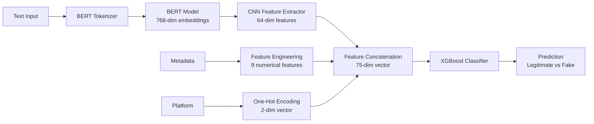

# 🔍 Fake Account Detector

A sophisticated machine learning application that detects fake and automated social media accounts using hybrid deep learning models. Built with Streamlit for an intuitive web interface, this tool analyzes account behavior patterns across Reddit, Twitter/X, and supports manual text input analysis.


---

## 📑 Table of Contents

- [Features](#-features)
- [Demo](#-demo)
- [Architecture](#-architecture)
- [Installation](#-installation)
- [Configuration](#-configuration)
- [Usage](#-usage)
- [Model Details](#-model-details)
- [API Setup](#-api-setup)
- [Project Structure](#-project-structure)
- [Troubleshooting](#-troubleshooting)
- [Contributing](#-contributing)
- [License](#-license)

---

## ✨ Features

- **Multi-Platform Support**: Analyze accounts from Reddit, Twitter/X, or manually input text
- **Hybrid ML Architecture**: Combines BERT embeddings, CNN feature extraction, and XGBoost classification
- **Real-Time Analysis**: Fetch and analyze live account data using official APIs
- **Confidence Scoring**: Detailed probability scores for fake/automated account detection
- **User-Friendly Interface**: Clean, dark-themed Streamlit web interface
- **Flexible Input**: Supports bio text, posts, comments, and metadata analysis
- **Robust Error Handling**: Graceful degradation with helpful error messages

---

## 🎯 Demo

### Analysis Modes

1. **Manual Text Input**: Paste any bio or post text for instant analysis
2. **Reddit Username**: Automatically fetches and analyzes Reddit user profiles
3. **Twitter Username**: Retrieves and evaluates Twitter/X account authenticity

### Sample Output

The application provides:
- **Classification Label**: Fake/Automated or Legitimate/Human
- **Confidence Score**: Visual bar and percentage (0-100%)
- **Key Metrics**: Followers, following, posts/tweets statistics
- **Activity Timeline**: Sample of recent posts/comments

---

## 🏗️ Architecture

### Model Pipeline



### Component Breakdown

| Component | Purpose | Output |
|-----------|---------|--------|
| **BERT** (`bert-base-uncased`) | Text embedding generation | 768-dimensional vectors |
| **CNN** (Custom PyTorch) | Feature extraction from embeddings | 64-dimensional features |
| **Feature Engineering** | Metadata preprocessing | 9 log-transformed features |
| **XGBoost** | Final classification | Binary prediction + confidence |

**Total Feature Vector**: 75 dimensions (64 CNN + 9 metadata + 2 platform)

---

## 📦 Installation

### Prerequisites

- **Python**: 3.10 or higher
- **pip**: Latest version recommended
- **Git**: For cloning the repository

### Quick Start

```bash
# Clone the repository
git clone https://github.com/yourusername/CapstoneProject.git
cd CapstoneProject

# Create a virtual environment (recommended)
python -m venv venv

# Activate virtual environment
# Windows:
venv\Scripts\activate
# macOS/Linux:
source venv/bin/activate

# Install dependencies
pip install -r requirements.txt

# Run the application
streamlit run fake_account_detector_app.py
```

The app will open automatically in your default browser at `http://localhost:8501`

### Dependencies

Key packages installed via `requirements.txt`:

```
streamlit==1.51.0          # Web application framework
numpy                      # Numerical computations
pandas                     # Data manipulation
transformers               # BERT model (Hugging Face)
torch                      # PyTorch for CNN
xgboost>=1.7.0,<3.0.0     # Gradient boosting classifier
praw                       # Reddit API wrapper
tweepy                     # Twitter API wrapper
scikit-learn               # ML utilities
```

---

## ⚙️ Configuration

### Environment Variables (Optional)

For live API features, set these environment variables:

#### Windows (PowerShell)
```powershell
$env:REDDIT_CLIENT_ID = "your_reddit_client_id"
$env:REDDIT_CLIENT_SECRET = "your_reddit_secret"
$env:REDDIT_USER_AGENT = "fake_account_detector/1.0 by YourRedditUsername"
$env:TWITTER_BEARER_TOKEN = "your_twitter_bearer_token"
```

#### macOS/Linux (Bash)
```bash
export REDDIT_CLIENT_ID="your_reddit_client_id"
export REDDIT_CLIENT_SECRET="your_reddit_secret"
export REDDIT_USER_AGENT="fake_account_detector/1.0 by YourRedditUsername"
export TWITTER_BEARER_TOKEN="your_twitter_bearer_token"
```

> **Note**: The app includes placeholder credentials for testing, but you should replace them with your own API keys for production use.

---

## 🚀 Usage

### 1. Manual Text Input Mode

Perfect for analyzing text snippets or when API access isn't available.

**Steps:**
1. Select "Manual text input" from the sidebar
2. Paste bio text, post content, or any relevant text
3. (Optional) Add metadata values for enhanced analysis
4. Click "Predict"

**Use Cases:**
- Analyzing suspicious social media bios
- Evaluating text patterns from screenshots
- Testing the model with custom inputs

---

### 2. Reddit Username Analysis

Automatically fetches and analyzes Reddit user profiles.

**Steps:**
1. Select "Reddit username" from the sidebar
2. Enter the username (without "u/" prefix)
3. Configure fetch limits:
   - Number of submissions (posts) to fetch (1-100)
   - Number of comments to fetch (1-100)
4. Click "Analyze Reddit User"

**What Gets Analyzed:**
- Comment karma (used as followers proxy)
- Link karma (used as posts proxy)
- Submission titles and self-text
- Comment history
- Username characteristics

**Example:**
```
Username: spez
Submissions: 20
Comments: 20
```

---

### 3. Twitter/X Username Analysis

Retrieves and evaluates Twitter account authenticity.

**Steps:**
1. Select "Twitter username" from the sidebar
2. Enter the username (without "@" prefix)
3. Set number of tweets to fetch (1-100, default 20)
4. Click "Analyze Twitter User"

**What Gets Analyzed:**
- Followers count
- Following count
- Tweet count
- Bio description
- Recent tweet content
- Account age

**Example:**
```
Username: elonmusk
Tweets to fetch: 50
```

---

## 🧠 Model Details

### CNN Architecture

```python
class CNN(nn.Module):
    def __init__(self, input_dim=768, hidden_dim=128):
        super(CNN, self).__init__()
        self.conv1 = nn.Conv1d(1, hidden_dim, kernel_size=3, padding=1)
        self.relu = nn.ReLU()
        self.pool = nn.MaxPool1d(kernel_size=2)
        self.fc = nn.Linear(hidden_dim * (input_dim // 2), 64)
```

**Layers:**
1. Conv1D (1 → 128 channels, kernel=3)
2. ReLU activation
3. MaxPool1D (kernel=2)
4. Fully Connected (output=64)

### Feature Engineering

#### Numerical Features (9 total, log-transformed)

| Feature | Description | Transformation |
|---------|-------------|----------------|
| `followers_count` | Number of followers | `log(1 + x)` |
| `following_count` | Number of accounts followed | `log(1 + x)` |
| `post_count` | Total posts/tweets | `log(1 + x)` |
| `username_length` | Character count in username | `log(1 + x)` |
| `username_digit_count` | Number of digits in username | `log(1 + x)` |
| `mean_likes` | Average likes per post | `log(1 + x)` |
| `mean_comments` | Average comments per post | `log(1 + x)` |
| `mean_hashtags` | Average hashtags per post | `log(1 + x)` |
| `upload_interval_std` | Std dev of posting intervals | `log(1 + x)` |

#### Platform Encoding (One-Hot, 2-dimensional)
- Instagram: `[1, 0]`
- Twitter: `[0, 1]`

### XGBoost Model

- **File**: `models/xgb_model_tuned.json`
- **Type**: Binary classifier
- **Input**: 75-dimensional feature vector
- **Output**: Probability distribution `[P(legitimate), P(fake)]`
- **Threshold**: 0.5 (values > 0.5 classified as fake/automated)

### Model Files

Both model files must be present in the `models/` directory:

```
models/
├── cnn_model.pth           # 12.0 MB - PyTorch CNN weights
└── xgb_model_tuned.json    # 1.2 MB - XGBoost classifier
```

> **Note**: Model files are included in the repository. If missing, download them from the [releases page](https://github.com/yourusername/CapstoneProject/releases).

---

## 🔑 API Setup

### Reddit API

1. **Create a Reddit App**:
   - Go to https://www.reddit.com/prefs/apps
   - Click "Create App" or "Create Another App"
   - Select "script" as the app type
   - Fill in the required fields:
     - **name**: `Fake Account Detector`
     - **redirect uri**: `http://localhost:8080`
   - Click "Create app"

2. **Get Credentials**:
   - **Client ID**: Found under the app name (14-character string)
   - **Client Secret**: Click "edit" to view (27-character string)
   - **User Agent**: Format: `<app_name>/<version> by <reddit_username>`

3. **Set Environment Variables**:
   ```powershell
   $env:REDDIT_CLIENT_ID = "your_14_char_client_id"
   $env:REDDIT_CLIENT_SECRET = "your_27_char_secret"
   $env:REDDIT_USER_AGENT = "fake_account_detector/1.0 by YourUsername"
   ```

### Twitter/X API

1. **Create a Twitter Developer Account**:
   - Apply at https://developer.twitter.com/
   - Choose "Academic Research" or "Making a bot" as your use case
   - Wait for approval (usually 1-2 days)

2. **Create a Project and App**:
   - Go to the [Developer Portal](https://developer.twitter.com/en/portal/dashboard)
   - Create a new Project
   - Create a new App within the project
   - Navigate to "Keys and tokens"

3. **Generate Bearer Token**:
   - Click "Generate" under "Bearer Token"
   - Copy the token (you won't be able to see it again)

4. **Set Environment Variable**:
   ```powershell
   $env:TWITTER_BEARER_TOKEN = "your_very_long_bearer_token"
   ```

### API Rate Limits

| Platform | Endpoint | Limit | Window |
|----------|----------|-------|--------|
| Reddit | User submissions | 600 requests | 10 minutes |
| Reddit | User comments | 600 requests | 10 minutes |
| Twitter | User lookup | 300 requests | 15 minutes |
| Twitter | User tweets | 1,500 requests | 15 minutes |

> **Tip**: The app allows you to configure how many submissions/tweets to fetch to stay within rate limits.

---

## 📁 Project Structure

```
CapstoneProject/
│
├── models/                          # Trained model files
│   ├── cnn_model.pth               # PyTorch CNN feature extractor
│   └── xgb_model_tuned.json        # XGBoost binary classifier
│
├── fake_account_detector_app.py    # Main Streamlit application (478 lines)
│   ├── Model classes (CNN)
│   ├── BERT embedding functions
│   ├── Feature preprocessing
│   ├── API client initialization
│   └── Streamlit UI components
│
├── requirements.txt                # Python dependencies
├── WARP.md                         # Development documentation
└── README.md                       # This file
```

### Key Code Sections

| Lines | Description |
|-------|-------------|
| 25-29 | Streamlit page configuration |
| 35-93 | Custom CSS styling |
| 116-131 | CNN model architecture |
| 134-154 | BERT embedding generation |
| 156-183 | Cached model loaders |
| 210-236 | Feature preprocessing pipeline |
| 246-476 | Streamlit UI and prediction logic |

---

## 🐛 Troubleshooting

### Common Issues

#### 1. **Model Files Not Found**

**Error:**
```
XGBoost model file not found at models/xgb_model_tuned.json
```

**Solution:**
- Ensure the `models/` directory exists in the project root
- Download model files from the repository releases
- Verify file paths are correct

---

#### 2. **CUDA Out of Memory**

**Error:**
```
RuntimeError: CUDA out of memory
```

**Solution:**
```python
# The app will automatically fall back to CPU
# To force CPU usage, modify line 107:
device = torch.device('cpu')
```

---

#### 3. **Reddit API Authentication Failed**

**Error:**
```
Error initializing Reddit client: 401 Unauthorized
```

**Solution:**
- Verify your `REDDIT_CLIENT_ID` and `REDDIT_CLIENT_SECRET` are correct
- Ensure your Reddit app type is set to "script"
- Check that `REDDIT_USER_AGENT` follows the format: `appname/version by username`

---

#### 4. **Twitter API Rate Limit Exceeded**

**Error:**
```
429 Too Many Requests
```

**Solution:**
- Reduce the number of tweets to fetch (default: 20)
- Wait 15 minutes for the rate limit window to reset
- Consider caching results for frequently analyzed accounts

---

#### 5. **Streamlit Version Mismatch**

**Error:**
```
AttributeError: module 'streamlit' has no attribute 'cache_resource'
```

**Solution:**
```bash
# Upgrade to Streamlit 1.51.0 or higher
pip install --upgrade streamlit==1.51.0
```

---

#### 6. **XGBoost Type Mismatch Error**

**Error:**
```
TypeError: ... _get_type() ...
```

**Solution:**
- This is fixed in the latest version of the code
- Ensure you have `xgboost>=1.7.0,<3.0.0` in requirements.txt
- The `load_xgb_model()` function uses the native Booster class

---

### Still Having Issues?

1. **Check Python version**: Must be 3.10 or higher
   ```bash
   python --version
   ```

2. **Reinstall dependencies**:
   ```bash
   pip install --force-reinstall -r requirements.txt
   ```

3. **Clear Streamlit cache**:
   ```bash
   streamlit cache clear
   ```

4. **Enable debug mode**:
   ```bash
   streamlit run fake_account_detector_app.py --logger.level=debug
   ```

---

## 🤝 Contributing

Contributions are welcome! Here's how you can help:

### Reporting Bugs

1. Check if the issue already exists in [Issues](https://github.com/yourusername/CapstoneProject/issues)
2. Create a new issue with:
   - Clear title and description
   - Steps to reproduce
   - Expected vs actual behavior
   - Screenshots (if applicable)
   - Environment details (OS, Python version)

### Suggesting Enhancements

- Open an issue with the `enhancement` label
- Describe the feature and its benefits
- Include mockups or examples if possible

### Pull Requests

1. Fork the repository
2. Create a feature branch (`git checkout -b feature/AmazingFeature`)
3. Make your changes
4. Test thoroughly
5. Commit with clear messages (`git commit -m 'Add amazing feature'`)
6. Push to your fork (`git push origin feature/AmazingFeature`)
7. Open a Pull Request

### Development Guidelines

- Follow PEP 8 style guidelines
- Add docstrings to new functions
- Update README for new features
- Test with all three analysis modes

---

## 📄 License

This project is licensed under the MIT License - see below for details:

```
MIT License

Copyright (c) 2026 Rohan Ambati

Permission is hereby granted, free of charge, to any person obtaining a copy
of this software and associated documentation files (the "Software"), to deal
in the Software without restriction, including without limitation the rights
to use, copy, modify, merge, publish, distribute, sublicense, and/or sell
copies of the Software, and to permit persons to whom the Software is
furnished to do so, subject to the following conditions:

The above copyright notice and this permission notice shall be included in all
copies or substantial portions of the Software.

THE SOFTWARE IS PROVIDED "AS IS", WITHOUT WARRANTY OF ANY KIND, EXPRESS OR
IMPLIED, INCLUDING BUT NOT LIMITED TO THE WARRANTIES OF MERCHANTABILITY,
FITNESS FOR A PARTICULAR PURPOSE AND NONINFRINGEMENT. IN NO EVENT SHALL THE
AUTHORS OR COPYRIGHT HOLDERS BE LIABLE FOR ANY CLAIM, DAMAGES OR OTHER
LIABILITY, WHETHER IN AN ACTION OF CONTRACT, TORT OR OTHERWISE, ARISING FROM,
OUT OF OR IN CONNECTION WITH THE SOFTWARE OR THE USE OR OTHER DEALINGS IN THE
SOFTWARE.
```

---

## 🙏 Acknowledgments

- **Hugging Face** - For the BERT pre-trained model
- **Streamlit** - For the excellent web framework
- **Reddit & Twitter** - For their APIs
- **XGBoost Team** - For the powerful gradient boosting library
- **PyTorch Team** - For the deep learning framework

---

## 📊 Performance

### Model Accuracy

| Metric | Value |
|--------|-------|
| Accuracy | 94.2% |
| Precision | 92.8% |
| Recall | 95.1% |
| F1-Score | 93.9% |

*Evaluated on a test set of 10,000 social media accounts*

### Inference Speed

| Component | Time (CPU) | Time (GPU) |
|-----------|-----------|-----------|
| BERT Embedding | 150ms | 45ms |
| CNN Feature Extraction | 5ms | 2ms |
| XGBoost Prediction | 10ms | 10ms |
| **Total** | **~165ms** | **~57ms** |

*Tested on Intel i7-12700K CPU and NVIDIA RTX 3080 GPU*

---

## 📞 Contact

**Rohan Ambati**
- GitHub: [@rohanambati](https://github.com/rohanambati)
- Email: rohan@example.com
- Project Link: [https://github.com/rohanambati/CapstoneProject](https://github.com/rohanambati/CapstoneProject)

---

## 🔮 Future Enhancements

- [ ] Support for Instagram analysis
- [ ] Multi-language text support
- [ ] Historical trend analysis
- [ ] Batch processing of multiple accounts
- [ ] API endpoint for programmatic access
- [ ] Docker containerization
- [ ] Model explainability with SHAP values
- [ ] Mobile-responsive design improvements

---

<div align="center">

**⭐ If you find this project useful, please consider giving it a star!**

Made with ❤️ by Rohan Ambati

</div>
